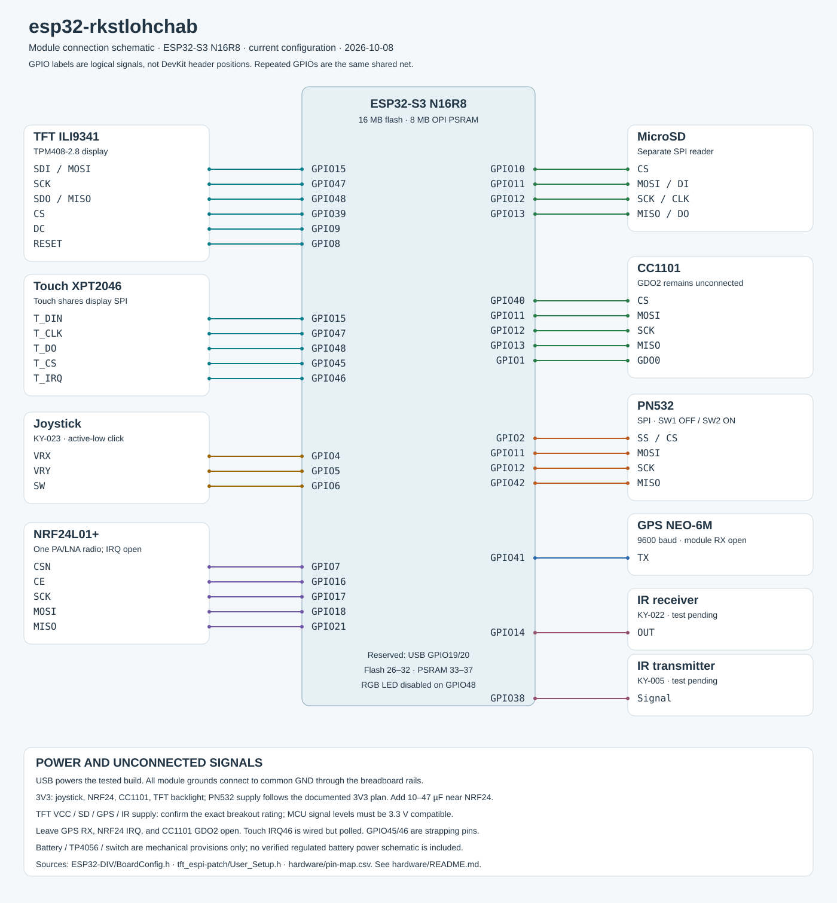
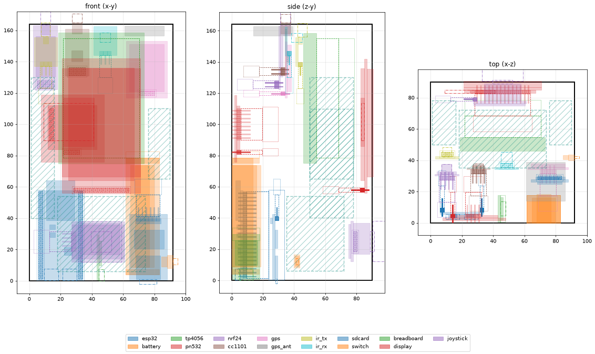

# esp32-rkstlohchab

ESP32-S3 N16R8 handheld wireless toolkit by **rkstlohchab**, with a TPM408-2.8 touchscreen, KY-023 joystick, Wi-Fi/BLE, and external radio, NFC, GPS and IR modules.

This repository contains the current firmware, the wiring used by this build, and the revision-2 enclosure. The firmware keeps its `ESP32-DIV/` sketch directory and internal compatibility identifiers. The visible branding is `rkstlohchab`.

## Start here

| I want to… | Open |
|---|---|
| See the wiring / final connection schematic | [Hardware guide](hardware/README.md) · [pin diagram](hardware/wiring.svg) |
| Split shared pins on a breadboard / wire direct jumpers | [Breadboard and direct wiring](hardware/BREADBOARD.md) |
| Get the component list | [Bill of materials](hardware/components.csv) |
| Look up a GPIO | [Pin map CSV](hardware/pin-map.csv) |
| Build or flash firmware | [Build and flash guide](docs/BUILD.md) |
| Download the compiled firmware | [Firmware files and checksums](firmware/README.md) |
| Print the case | [Enclosure guide](enclosure/README.md) · [download ZIP](enclosure/enclosure-v2.zip) |
| Explore the 3D assembly | [Interactive viewer](enclosure/enclosure.html) · [layout drawing](enclosure/layout-v2.png) |
| Avoid the assembly mistakes we encountered | [Mistakes and fixes, including PN532 mode switches](docs/ASSEMBLY-MISTAKES.md) |
| Check what has actually been tested | [Status and limitations](docs/STATUS.md) |
| Find the source | [Arduino sketch](ESP32-DIV/ESP32-DIV.ino) · [board pin configuration](ESP32-DIV/BoardConfig.h) |
| Apply the required display patches | [TFT_eSPI patch](tft_espi-patch/README.md) |



## Use the device

1. Wire the board using the [current hardware guide](hardware/README.md).
2. Flash the N16R8 firmware using the [build and flash guide](docs/BUILD.md).
3. Boot normally for the primary UI. Hold the joystick click while resetting, then release, for the alternate full-screen UI. Restart to switch modes.
4. Use the joystick to navigate; touch calibration is available in the primary UI.

The latest branded build compiles at **2,724,621 bytes (86% of the 3 MB app slot)** and **159,604 bytes of static RAM (48%)**. It has not been flashed or hardware-tested in this documentation update. Earlier hardware results are recorded separately in [status](docs/STATUS.md).

## 3D enclosure

Revision 2 is **96.4 × 168.4 × 94.0 mm** (width × height × depth), excluding antennas and joystick projection. It includes clearance for breadboard jumper housings and loose wire bays.



- [Back tub STL](enclosure/stl/enclosure_back_tub.stl)
- [Front plate STL](enclosure/stl/enclosure_front_plate.stl)
- [Parametric source and rebuild instructions](enclosure/README.md)

The enclosure passes digital collision and solid checks; it has **not been physically print-tested**. Battery/charger/switch pockets are mechanical provisions. The verified electrical build runs on USB with the battery circuit disconnected.

## Repository map

```text
ESP32-DIV/          Arduino firmware and board-specific GPIO configuration
hardware/           Current wiring, component list, pin map and diagram generator
enclosure/          Revision-2 STL files, 3D viewer, layout and parametric source
firmware/           Current N16R8 binaries and SHA-256 checksums
docs/               Build guide, status and local documentation entry page
tft_espi-patch/     Required TPM408 display configuration and rotation patch
Libraries/          Upstream library archives; see build guide before using
PCB/, Schematic/   Legacy upstream PCB designs, not this breadboard build
licenses/           Notices for incorporated third-party code
```

The files `PORT.md`, `MERGE.md`, and `MARAUDER-UI-FIX.md` are historical development notes. Start with the current guides above: older notes contain earlier pin assignments and build sizes. Legacy bundled binaries and the old upstream web flasher are excluded from this clean repository snapshot.

## License and acknowledgments

This project incorporates ESP32-DIV and ESP32 Marauder code. Required upstream MIT notices are preserved in [LICENSE](LICENSE) and [licenses/ESP32Marauder-MIT.txt](licenses/ESP32Marauder-MIT.txt). Branding changes do not change those notices. Use wireless testing features only on equipment and networks you own or have permission to test.
