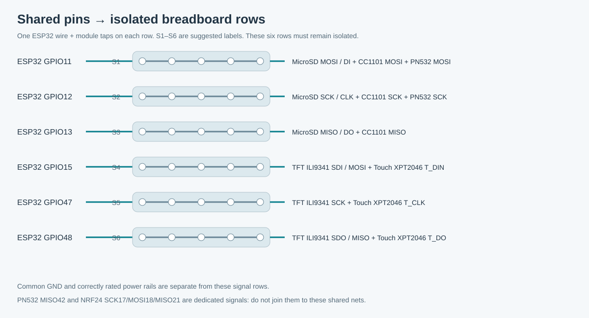

# Breadboard sharing and direct ESP32 jumpers

Use this alongside the [complete pin diagram](wiring.svg) and [hardware power notes](README.md#power-connections). The firmware determines which wires share a net; the breadboard rows below are a suggested physical layout, not a record of exact numbered rows in the assembled prototype.

## Shared signal pins: split these on the breadboard

Run **one jumper from the ESP32 GPIO to its own connected five-hole breadboard row**, then connect each listed module pin to that same row. Use a different isolated row for each GPIO. On a typical breadboard, the two five-hole groups on opposite sides of the centre gap are not connected. Bridge only if you deliberately need the other side.

| Suggested isolated row | ESP32 GPIO → row | Module pins connected to that same row |
|---|---|---|
| S1 | GPIO**11** | MicroSD **MOSI / DI**; CC1101 **MOSI**; PN532 **MOSI** |
| S2 | GPIO**12** | MicroSD **SCK / CLK**; CC1101 **SCK**; PN532 **SCK** |
| S3 | GPIO**13** | MicroSD **MISO / DO**; CC1101 **MISO** |
| S4 | GPIO**15** | TFT ILI9341 **SDI / MOSI**; Touch XPT2046 **T_DIN** |
| S5 | GPIO**47** | TFT ILI9341 **SCK**; Touch XPT2046 **T_CLK** |
| S6 | GPIO**48** | TFT ILI9341 **SDO / MISO**; Touch XPT2046 **T_DO** |

S1–S6 are labels you choose, not mandatory printed row numbers. Each is an independent electrical net. Keep signal wires short, especially SPI clock and data.

**Do not combine all MOSI or all MISO pins into one row.** Display MOSI15 and storage MOSI11 are separate nets; display MISO48, storage MISO13, PN532 MISO42 and NRF24 MISO21 are all separate. NRF24 SCK17/MOSI18/MISO21 each go only to that radio in this build.

## Dedicated signals: one direct jumper to the ESP32

These have one module endpoint in the current fitted configuration. They can connect directly to the GPIO-labelled ESP32 header, without a breadboard split. Routing one through an isolated breadboard row is electrically equivalent if it makes assembly easier.

| Module | Direct ESP32 GPIO ↔ module pin |
|---|---|
| Joystick | GPIO**4** ↔ **VRX**; GPIO**5** ↔ **VRY**; GPIO**6** ↔ **SW** |
| TFT ILI9341 | GPIO**39** ↔ **CS**; GPIO**9** ↔ **DC**; GPIO**8** ↔ **RESET** |
| Touch XPT2046 | GPIO**45** ↔ **T_CS**; GPIO**46** ↔ **T_IRQ** |
| NRF24L01+ | GPIO**7** ↔ **CSN**; GPIO**16** ↔ **CE**; GPIO**17** ↔ **SCK**; GPIO**18** ↔ **MOSI**; GPIO**21** ↔ **MISO** |
| MicroSD | GPIO**10** ↔ **CS** |
| CC1101 | GPIO**40** ↔ **CS**; GPIO**1** ↔ **GDO0** |
| PN532 | GPIO**2** ↔ **SS / CS**; GPIO**42** ↔ **MISO** |
| GPS NEO-6M | GPIO**41** ↔ **TX** |
| IR receiver | GPIO**14** ↔ **OUT** |
| IR transmitter | GPIO**38** ↔ **Signal** |

The KY-023 VRX4/VRY5/SW6 connections are documented as direct to the ESP32 in the existing build notes. For the other dedicated signals, this table describes the direct jumper wiring supported by the current pin assignments; the notes do not establish every jumper's actual physical routing.

GPIO45/46 are strapping pins in the tested touch wiring; preserve the current reset levels. IR14/38 are dedicated only while NRF24 #2 is absent. Do not install the second radio on those placeholder assignments.

## Power: use the common breadboard rails

- ESP32 **GND → ground rail**; each fitted module's GND → that same rail.
- ESP32 **3V3 → a labelled 3V3 rail**; connect only modules/inputs requiring 3.3 V to it. Joystick `+5V` silkscreen is supplied from **3V3** in this build.
- TFT backlight LED → 3V3 rail. NRF24 VCC → 3V3 rail, with its capacitor directly across local VCC/GND.
- If an exact breakout needs a 5 V input, use a separate labelled **5 V rail** after checking its rating and signal compatibility. **Never bridge 3V3 and 5 V rails.** See [module-specific supply constraints](README.md#power-connections).
- Many breadboard power rails are split halfway along their length. Check continuity and bridge matching rail segments only when needed.

Power off before changing jumpers. Do not push multiple Dupont connectors onto one ESP32 header pin; split shared nets on the breadboard instead. The battery circuit stays disconnected until a regulated power path has been specified and tested.

## Leave these unconnected

NRF24 IRQ, CC1101 GDO2, GPS RX, all unfitted second/third radio connections, and disabled buzzer/battery-ADC placeholders. All module grounds still need the common GND rail.
